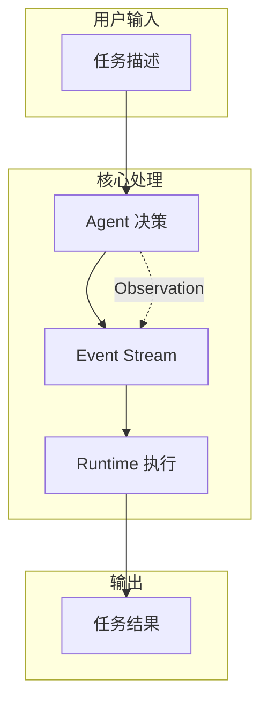
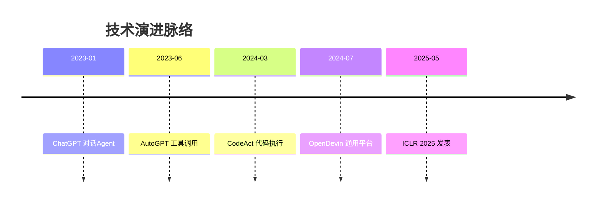
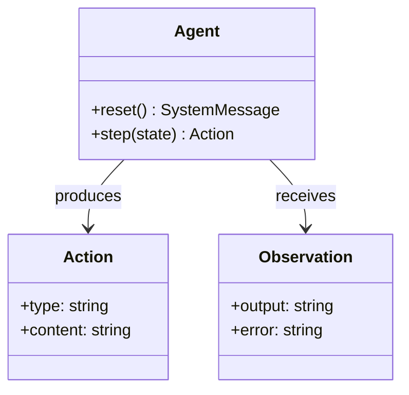
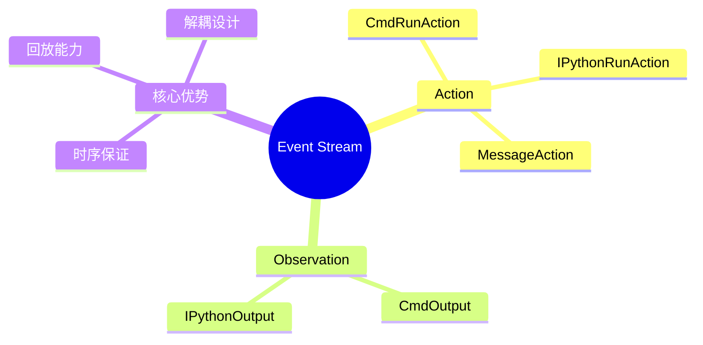

# Paper Reading Skill

系统化的论文研读方法，产出**双版本笔记**，适合不同读者和不同阶段的复习。

## Workflow

### 1. 准备阶段

1. **获取论文** - arXiv PDF 或本地文件
2. **快速扫描** - 提取标题、摘要、章节结构
3. **创建目录** - 在 `paper_learning/notes/` 创建笔记文件

### 2. 大白话版本 (15 min)

1. **一句话概括** - 10 字内核心价值
2. **类比解释** - 用比喻让新手能懂
3. **架构图** - ASCII 展示核心组件
4. **痛点对比** - 现有方案的缺陷表格
5. **优缺点** - 简洁列出

### 3. 深入版本 (30 min)

按 5W1H 框架深度分析：

| 维度 | 内容 |
|------|------|
| **What** | 核心定义、技术架构、组件详解 |
| **Who** | 作者、用户、生态定位 |
| **When** | 时间线、技术演进脉络 |
| **Where** | 发表平台、应用场景、资源链接 |
| **Why** | 研究缺口、核心贡献、学术价值 |
| **How** | 技术实现、评估协议、性能结果 |

### 4. TODO 章节

1. **理解检验** - 2-3 个核心问题
2. **批判性思考** - 1-2 个开放性问题
3. **实践任务** - Level 1/2/3 难度分级

### 5. 知识提取

1. **原子概念** - 存入 `insights/{概念名}.md`
2. **更新学习计划** - 在 `plan.md` 标记完成

### 6. 可视化产出

1. **Canvas 思维导图** - `notes/{论文名}.canvas` 论文结构可视化
2. **Mermaid 图表** - 在笔记中嵌入架构图、时间线

---

## Note Types

### Beginner Note (`_大白话.md`)

| 属性 | 类型 | 说明 |
|------|------|------|
| `title` | string | `{论文名} - 大白话版本` |
| `paper` | string | 论文名称 |
| `date` | date | 阅读日期 (YYYY-MM-DD) |
| `version` | string | 固定值 `beginner` |

**必需章节**:

| 章节 | 内容 |
|------|------|
| 一句话 | 10 字内核心价值 |
| 这项目是干嘛的 | 类比/比喻解释 |
| 为什么需要它 | 现有方案缺陷对比表 |
| 怎么工作的 | ASCII 架构图 + 组件表 |
| 效果如何 | 场景效果表 |
| 优缺点 | ✅/❌ 列表 |

### Advanced Note (`_深入.md`)

| 属性 | 类型 | 说明 |
|------|------|------|
| `title` | string | `{论文名} - 深入阅读版本` |
| `paper` | string | 论文名称 |
| `arxiv` | string | arXiv ID (可选) |
| `date` | date | 阅读日期 |
| `version` | string | 固定值 `advanced` |

**必需章节**:

| 章节 | 5W1H 维度 |
|------|-----------|
| What - 核心定义 | What |
| Who - 作者与生态 | Who |
| When - 技术演进 | When |
| Where - 平台与场景 | Where |
| Why - 研究缺口 | Why |
| How - 技术实现 | How |
| TODO - 深度思考 | 后续反思 |

### Atomic Concept (`insights/*.md`)

跨论文复用的知识单元。

| 属性 | 类型 | 说明 |
|------|------|------|
| `title` | string | 概念名称 |
| `type` | string | 固定值 `concept` |

**必需章节**:

| 章节 | 内容 |
|------|------|
| 定义 | 一句话定义 |
| 核心要点 | 2-4 个要点 |
| 示例 | 代码或图示 |
| 相关论文 | wikilinks 列表 |

---

## Templates

### Beginner Template

```markdown
---
title: {论文名} - 大白话版本
paper: {论文名}
date: {阅读日期}
version: beginner
---

# {论文名} - 大白话版本

> 📄 [论文原文](../pdfs/{论文文件}.pdf) | 🔗 [深入版本](./{论文名}_深入.md)
>
> **一句话**: {10字内核心价值}

## 这项目是干嘛的？

{类比/比喻解释}

## 为什么需要它？

| 现有方案 | 缺陷 |
|----------|------|
| {方案A} | {...} |
| {方案B} | {...} |

**痛点**: {一句话总结}

## 怎么工作的？

```
{ASCII 架构图}
```

| 组件 | 作用 |
|------|------|
| {组件1} | {...} |

## 效果如何？

| 场景 | 效果 |
|------|------|
| {场景1} | {...} |

## 优缺点

✅ {优点} | ❌ {缺点}

## 对我有用吗？

- **如果你是{角色}**: {应用场景}
```

### Advanced Template

```markdown
---
title: {论文名} - 深入阅读版本
paper: {论文名}
arxiv: {arXiv ID}
date: {阅读日期}
version: advanced
---

# {论文名} - 深入阅读版本

> 📄 [论文原文](../pdfs/{论文文件}.pdf) | 📓 [大白话版本](./{论文名}_大白话.md)

## What - 核心定义

{学术级定义}

### 技术架构

```
{详细架构图}
```

### 核心组件

| 组件 | 功能 | 设计理由 |
|------|------|----------|

## Who - 作者与生态

| 维度 | 信息 |
|------|------|
| **作者** | {机构/背景} |
| **用户** | {目标用户} |
| **生态位** | {与竞品关系} |

## When - 技术演进

```
{时间线图}
```

## Where - 平台与场景

| 类型 | 内容 |
|------|------|
| **发表** | {会议/journal} |
| **代码** | {GitHub链接} |
| **应用** | {领域场景} |

## Why - 研究缺口

| 缺口 | 本文方案 |
|------|----------|

**核心贡献**: {一句话}

## How - 技术实现

### 关键技术

#### 1. {技术名称}

```python
{代码片段}
```

**设计理念**: {解释}

### 评估结果

| 方法 | 指标 | 结果 |
|------|------|------|

## TODO - 深度思考

### 理解检验

- [ ] **Q1**: {核心问题}
- [ ] **Q2**: {关键细节}

### 批判性思考

- {开放性问题}

### 实践任务

| 难度 | 任务 |
|------|------|
| Level 1 | {体验级} |
| Level 2 | {定制级} |
| Level 3 | {扩展级} |

## 延伸阅读

| 论文 | 关系 |
|------|------|

---

## 理解程度: ████████░░ {百分比}
```

### Atomic Concept Template

```markdown
---
title: {概念名}
type: concept
---

# {概念名}

> **定义**: {一句话定义}

## 核心要点

- {要点1}
- {要点2}

## 示例

{代码片段或图示}

## 相关论文

- [[{论文名}]]: {如何使用这个概念}

## 相关概念

- [[{概念A}]]: {关系说明}
```

---

## 5W1H Reference

| 维度 | 关键问题 | 输出内容 |
|------|----------|----------|
| **What** | 核心定义？架构？组件？ | 定义 + 架构图 + 组件表 |
| **Who** | 作者？用户？竞品？ | 作者表 + 用户列表 + 生态定位 |
| **When** | 时间线？演进？ | ASCII 时间线 + 演进表 |
| **Where** | 平台？场景？资源？ | 平台表 + 场景表 + 链接 |
| **Why** | 问题？缺口？价值？ | 缺口表 + 贡献总结 |
| **How** | 实现？验证？结果？ | 代码片段 + 评估表 + 结果表 |

详见 [references/5W1H_FRAMEWORK.md](references/5W1H_FRAMEWORK.md)。

---

## Directory Structure

```
paper_learning/
├── plan.md                    # 学习计划与进度
├── notes/                     # 论文笔记
│   ├── {论文名}_大白话.md
│   └── {论文名}_深入.md
├── pdfs/                      # 原论文文件
│   └── {论文名}.pdf
└── insights/                  # 原子概念库
    ├── {概念名}.md
    └── {主题}-对比.md         # 跨论文对比
```

---

## Cross-Paper Linking

### 概念关联

发现可复用概念时：
1. 在 `insights/` 创建或更新概念文件
2. 概念文件「相关论文」中添加 wikilink
3. 笔记中用 `[[概念名]]` 引用

### 对比模式

多论文涉及同一主题时：
1. 创建 `insights/{主题}-对比.md`
2. 横向对比表格
3. 各笔记中添加链接

---

## Visualization

论文可视化支持两种方式：**Mermaid（嵌入 Markdown）** 和 **Canvas（独立画布）**。

### Mermaid 图表

在笔记中直接嵌入，Obsidian 自动渲染。

#### 架构图（flowchart）

```markdown
## 怎么工作的？


```

#### 时间线（timeline）

```markdown
## When - 技术演进


```

#### 类图（classDiagram）

```markdown
### 核心组件


```

#### 概念图（mindmap）

```markdown
## 关键概念索引


```

---

### Canvas 思维导图

独立 `.canvas` 文件，无限画布可视化论文结构。

#### Canvas 结构

| Node Type | 内容 |
|-----------|------|
| **中心节点** | 论文标题 + 一句话概括 |
| **What 节点** | 核心定义 + 架构嵌入 |
| **Why 节点** | 研究缺口 + 解决方案 |
| **How 节点** | 技术实现 + 代码片段 |
| **TODO 节点** | 实践任务清单 |
| **链接节点** | 相关论文 wikilink |

#### Canvas 模板

生成 `notes/{论文名}.canvas`：

```json
{
  "nodes": [
    {
      "id": "center",
      "type": "text",
      "text": "# {论文名}\n\n**一句话**: {核心价值}\n\n📄 [PDF](../pdfs/{论文}.pdf)",
      "x": 0, "y": 0,
      "width": 400, "height": 200,
      "color": "4"
    },
    {
      "id": "what",
      "type": "text",
      "text": "## What\n\n{核心定义}\n\n```\n{简化架构}\n```",
      "x": -500, "y": -200,
      "width": 300, "height": 250
    },
    {
      "id": "why",
      "type": "text",
      "text": "## Why\n\n**研究缺口**:\n- {缺口1}\n- {缺口2}\n\n**解决方案**: {方案}",
      "x": 500, "y": -200,
      "width": 300, "height": 250
    },
    {
      "id": "how",
      "type": "text",
      "text": "## How\n\n**关键技术**:\n1. {技术1}\n2. {技术2}\n\n**效果**: {结果}",
      "x": -500, "y": 200,
      "width": 300, "height": 250
    },
    {
      "id": "todo",
      "type": "text",
      "text": "## TODO\n\n- [ ] {任务1}\n- [ ] {任务2}\n- [ ] {任务3}",
      "x": 500, "y": 200,
      "width": 300, "height": 200
    },
    {
      "id": "links",
      "type": "file",
      "file": "notes/{相关论文}_深入.md",
      "x": 0, "y": 400,
      "width": 250, "height": 200
    }
  ],
  "edges": [
    {"id": "e1", "fromNode": "center", "toNode": "what", "fromSide": "left", "toSide": "right"},
    {"id": "e2", "fromNode": "center", "toNode": "why", "fromSide": "right", "toSide": "left"},
    {"id": "e3", "fromNode": "center", "toNode": "how", "fromSide": "left", "toSide": "right"},
    {"id": "e4", "fromNode": "center", "toNode": "todo", "fromSide": "right", "toSide": "left"},
    {"id": "e5", "fromNode": "center", "toNode": "links", "fromSide": "bottom", "toSide": "top"}
  ]
}
```

#### Canvas 布局指南

| 布局 | 适用场景 |
|------|----------|
| **放射状** | 论文结构概览（中心 + 四向延伸） |
| **流程状** | 技术流程（左→右链式） |
| **分组状** | 多论文对比（Group 包裹同类） |

---

### 可视化选择

| 场景 | 推荐 |
|------|------|
| 复杂架构 | Mermaid flowchart + Canvas 结构图 |
| 时间演进 | Mermaid timeline |
| 类关系 | Mermaid classDiagram |
| 概念树 | Mermaid mindmap |
| 多论文对比 | Canvas 分组布局 |

---

## Validation Checklist

完成后检查：

### Frontmatter

- [ ] `title` 格式正确
- [ ] `version` 为 `beginner` 或 `advanced`
- [ ] `date` 格式为 YYYY-MM-DD

### Links

- [ ] PDF 链接指向 `../pdfs/` 目录
- [ ] 双版本笔记相互链接正确
- [ ] wikilinks 使用 `[[笔记名]]` 格式

### Content

- [ ] 大白话版本有架构图
- [ ] 深入版本覆盖全部 5W1H 章节
- [ ] TODO 章节有 2+ 问题

### Atomic Concepts

- [ ] 概念文件在 `insights/` 目录
- [ ] 有「定义」「核心要点」「相关论文」

---

## Skill Collaboration

| Skill | 场景 |
|-------|------|
| **obsidian-markdown** | 确保 wikilinks、callouts、Mermaid 格式正确 |
| **json-canvas** | 创建 Canvas 思维导图、可视化论文结构 |
| **defuddle** | 从论文相关网页提取补充材料 |

---

## References

- [5W1H 深度框架](references/5W1H_FRAMEWORK.md)
- [示例笔记](references/EXAMPLES.md)
- [常见问题](references/FAQ.md)