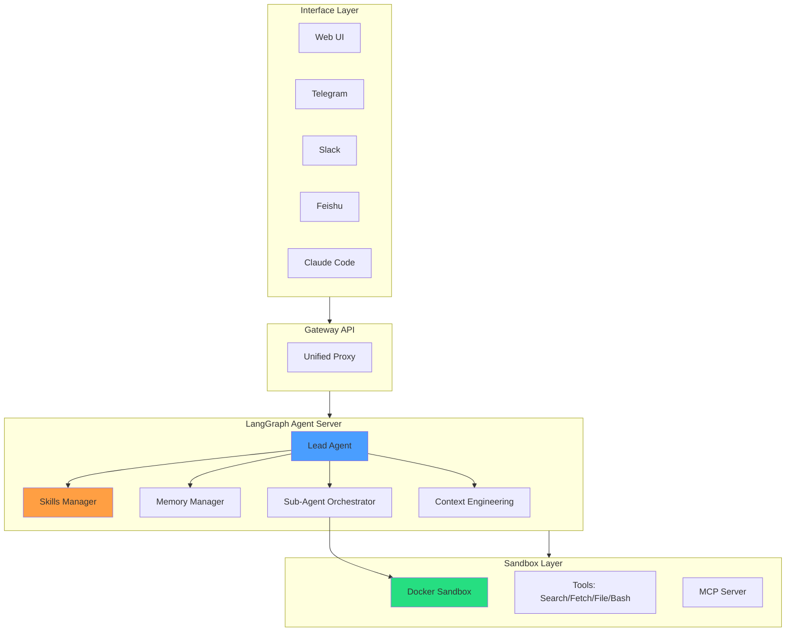
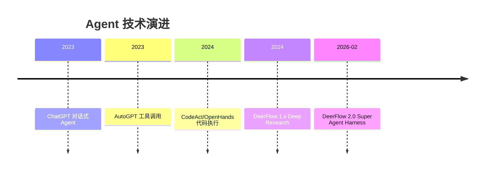
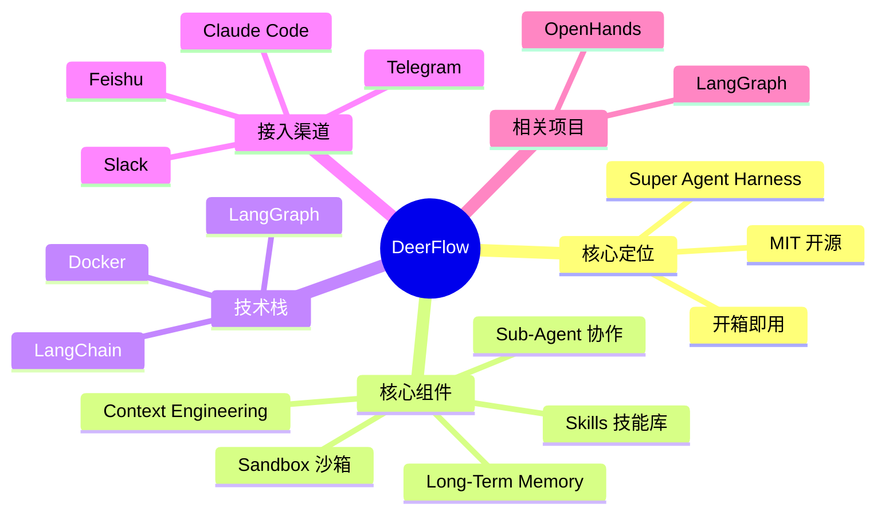

# DeerFlow - 深入阅读版本

> 📄 **项目地址**: [GitHub - bytedance/deer-flow](https://github.com/bytedance/deer-flow)
>
> 📓 **大白话版本**: [DeerFlow_大白话.md](./DeerFlow_大白话.md)

---

## What - 核心定义

### 学术级定义

DeerFlow (**D**eep **E**xploration and **E**fficient **R**esearch **Flow**) 是字节跳动开源的 **Super Agent Harness（超级智能体框架）**，它编排子智能体、记忆系统和沙箱执行环境，通过可扩展的技能系统，让 AI 能够完成复杂的多步骤任务。

> **关键区分**: DeerFlow 2.0 不只是一个"框架"（framework），而是 **Harness（框架+基础设施）**——开箱即用，"电池已安装"。

### 技术架构

```
┌─────────────────────────────────────────────────────────────────────────┐
│                         Interface Layer                                  │
│  ┌────────────────────────────────────────────────────────────────────┐ │
│  │  Web UI │ Telegram │ Slack │ Feishu │ Claude Code Integration      │ │
│  └────────────────────────────────────────────────────────────────────┘ │
└────────────────────────────┬────────────────────────────────────────────┘
                             │
                             ▼
┌─────────────────────────────────────────────────────────────────────────┐
│                         Gateway API Layer                                │
│  ┌────────────────────────────────────────────────────────────────────┐ │
│  │  Unified Proxy: /api/*                                             │ │
│  │  • Chat / Stream / Models / Skills / Threads / Files              │ │
│  │  • DELETE /api/threads/{thread_id} 清理线程数据                     │ │
│  └────────────────────────────────────────────────────────────────────┘ │
└────────────────────────────┬────────────────────────────────────────────┘
                             │
                             ▼
┌─────────────────────────────────────────────────────────────────────────┐
│                       LangGraph Agent Server                             │
│  ┌────────────────────────────────────────────────────────────────────┐ │
│  │                      Lead Agent                                    │ │
│  │  ┌───────────────────┐  ┌───────────────────┐                     │ │
│  │  │ Skills Manager    │  │ Memory Manager    │                     │ │
│  │  │ • Progressive     │  │ • User Profile    │                     │ │
│  │  │   Loading         │  │ • Preferences     │                     │ │
│  │  │ • Skill Archive   │  │ • Knowledge Base  │                     │ │
│  │  │   Installation    │  │ • Deduplication   │                     │ │
│  │  └───────────────────┘  └───────────────────┘                     │ │
│  │                                                                    │ │
│  │  ┌───────────────────┐  ┌───────────────────┐                     │ │
│  │  │ Sub-Agent         │  │ Context           │                     │ │
│  │  │ Orchestrator      │  │ Engineering       │                     │ │
│  │  │ • Dynamic Spawn   │  │ • Isolation       │                     │ │
│  │  │ • Parallel Exec   │  │ • Summarization   │                     │ │
│  │  │ • Structured      │  │ • Compression     │                     │ │
│  │  │   Results         │  │                   │                     │ │
│  │  └───────────────────┘  └───────────────────┘                     │ │
│  └────────────────────────────────────────────────────────────────────┘ │
└────────────────────────────┬────────────────────────────────────────────┘
                             │
                             ▼
┌─────────────────────────────────────────────────────────────────────────┐
│                         Sandbox Layer                                    │
│  ┌────────────────────────────────────────────────────────────────────┐ │
│  │  Docker Sandbox (AioSandboxProvider / Provisioner)                │ │
│  │                                                                    │ │
│  │  /mnt/skills/public/    ← 内置技能                                 │ │
│  │  /mnt/skills/custom/    ← 自定义技能                                │ │
│  │  /mnt/user-data/                                                  │ │
│  │    ├── uploads/        ← 用户上传文件                               │ │
│  │    ├── workspace/       ← Agent 工作目录                            │ │
│  │    └── outputs/         ← 最终产出                                  │ │
│  │                                                                    │ │
│  │  Tools: Web Search │ Web Fetch │ File Ops │ Bash │ Browser        │ │
│  │  MCP Server Support: HTTP/SSE + OAuth (client_credentials,        │ │
│  │                                      refresh_token)                │ │
│  └────────────────────────────────────────────────────────────────────┘ │
└─────────────────────────────────────────────────────────────────────────┘
```

### 核心组件详解

| 组件 | 功能 | 设计理由 |
|------|------|----------|
| **Skills System** | 可扩展的技能模块（Markdown 定义工作流） | 避免 Agent 从零学习，渐进加载保持上下文精简 |
| **Sub-Agent Orchestrator** | 动态派生子智能体，并行执行，结构化结果汇总 | 复杂任务分解，小时级任务可完成 |
| **Sandbox Provider** | Docker/Kubernetes 隔离执行环境 | 安全性 + 可审计 + 零污染 |
| **Long-Term Memory** | 跨会话持久化用户画像、偏好、知识 | "认识用户"，越用越顺手 |
| **Context Engineering** | 子 Agent 上下文隔离 + 智能压缩总结 | 长任务不撑爆 context window |
| **Gateway API** | 统一代理层 + Python 嵌入式客户端 | 降低集成门槛，API 规范一致 |
| **IM Channels** | Telegram/Slack/Feishu 接入 | 多端统一，适合企业场景 |

---

## Who - 作者与生态

### 作者团队

| 背景 | 机构 | 贡献 |
|------|------|------|
| 核心 | Daniel Walnut, Henry Li（字节跳动） | 2.0 全新架构设计与实现 |
| 企业 | ByteDance / BytePlus | 基础设施、InfoQuest 搜索工具集成 |
| 社区 | GitHub Contributors | Skills 贡献、Bug 修复、文档完善 |

### 用户群体

1. **研究者**：研究 Agent 架构、多智能体协作、上下文工程
2. **开发者**：构建 AI 辅助工具、定制专用 Agent
3. **企业**：内部部署、私有化、飞书/Slack 集成
4. **创业者**：MIT 协议商用、产品化

### 生态定位

| 框架 | 定位 | 与 DeerFlow 关系 |
|------|------|------------------|
| LangGraph | 工作流编排引擎 | **底层依赖** |
| LangChain | LLM 工具链 | **底层依赖** |
| OpenHands | AI 程序员平台 | **能力继承**（沙箱 + 执行） |
| Claude Code | 编程助手 | **互补**（DeerFlow 有 claude-to-deerflow 技能） |

---

## When - 技术演进

### 时间线

```
2024.xx ──── DeerFlow 1.x 发布（Deep Research 框架）
    │         • 聚焦深度研究场景
    │         • 社区扩展到更多场景
    │
2026.02 ──── DeerFlow 2.0 重构发布
    │         • 全新架构，共享无代码
    │         • 登顶 GitHub Trending #1
    │         • 定位：Super Agent Harness
    │         • 技能系统 + 子Agent + 记忆 + 沙箱
    │
Now ──────── 生态持续发展
             • 1.x 分支仍在维护（main-1.x）
             • 2.0 是主要开发方向
```

### 技术演进脉络

| 阶段 | 代表工作 | 核心突破 |
|------|----------|----------|
| 1. 对话 Agent | ChatGPT | 自然语言交互 |
| 2. 工具调用 Agent | LangChain, AutoGPT | API 调用能力 |
| 3. 代码执行 Agent | CodeAct, OpenHands | 代码即行动 + 沙箱 |
| 4. **Agent Harness** | **DeerFlow 2.0** | 框架 + 基础设施 + 技能 + 记忆 + 多渠道 |

---

## Where - 平台与场景

### 资源链接

| 类型 | 地址 |
|------|------|
| **GitHub** | https://github.com/bytedance/deer-flow |
| **官网** | https://deerflow.tech |
| **文档** | backend/docs/CONFIGURATION.md, MCP_SERVER.md |
| **贡献指南** | CONTRIBUTING.md |

### 应用场景

| 场景 | 具体任务 |
|------|----------|
| **深度研究** | 文献调研、技术调研、市场分析 |
| **内容创作** | 报告生成、PPT 制作、网页生成 |
| **软件开发** | 代码编写、bug 修复、测试 |
| **数据管道** | 数据处理流水线构建 |
| **自动化流程** | 内容工作流自动化 |

### 多渠道接入

| 渠道 | 传输方式 | 部署难度 |
|------|----------|----------|
| Telegram | Bot API (long-polling) | 简单 |
| Slack | Socket Mode | 中等 |
| Feishu/Lark | WebSocket | 中等 |

> 无需公网 IP，所有渠道均支持本地部署。

---

## Why - 研究缺口

### 研究缺口分析

| 缺口类型 | 现有问题 | DeerFlow 2.0 解决方案 |
|----------|----------|------------------------|
| **执行环境缺失** | 大部分框架只能"聊"，不能"干" | Docker 沙箱 + 文件系统 + 工具链 |
| **技能不足** | 只有基础工具，无专业流程 | Skills 技能库，Markdown 定义工作流 |
| **无长期记忆** | 每次对话从零开始 | Long-Term Memory，跨会话记忆 |
| **上下文爆炸** | 长任务撑爆 context window | Context Engineering，隔离+压缩+总结 |
| **闭源限制** | 商业产品无法定制研究 | MIT 协议，完全开源 |
| **单渠道限制** | 只能通过 Web/CLI 使用 | Telegram/Slack/Feishu 多端接入 |

### 核心贡献

1. **首次提出 "Super Agent Harness" 概念**：不只是框架，而是框架 + 基础设施
2. **Skills 系统**：可扩展的技能模块，渐进加载，降低上下文压力
3. **Context Engineering**：子 Agent 上下文隔离 + 智能总结，支持小时级任务
4. **多渠道统一接入**：企业级部署，无需公网 IP

---

## How - 技术实现

### 1. Skills 技能系统

```markdown
# SKILL.md 结构示例

---
version: 1.0
author: deerflow-team
compatibility: deerflow-2.0+
---

## 技能名称
research - 深度研究技能

## 工作流程
1. 信息收集：使用 web-search 搜索相关资料
2. 信息整理：使用 file-ops 创建整理目录
3. 报告生成：使用 report-generation 技能

## 最佳实践
- 并行搜索多个关键词
- 结构化整理信息
- 生成带引用的报告

## 工具依赖
- web-search
- web-fetch
- file-ops
```

**设计理念**：
- Markdown 格式，低门槛定制
- 渐进加载，按需激活
- 技能可组合（一个技能可调用其他技能）

### 2. Sub-Agent 协作机制

```python
# 子 Agent 派生流程（简化示意）

class SubAgentOrchestrator:
    def spawn(self, task: str, context: dict):
        """派生子 Agent 处理子任务"""
        sub_agent = SubAgent(
            task=task,
            context=context,  # 隔离上下文
            tools=self.get_tools_for_task(task),
            termination=self.get_termination_condition(task)
        )
        return sub_agent.run()

    def orchestrate(self, main_task: str):
        """分解主任务，并行派生子 Agent"""
        subtasks = self.decompose(main_task)

        # 并行执行
        results = parallel_execute([
            self.spawn(task, isolated_context)
            for task in subtasks
        ])

        # 结构化汇总
        return self.synthesize(results)
```

**设计理念**：
- 子 Agent 上下文隔离（看不到主 Agent 历史）
- 并行执行（多个子 Agent 同时工作）
- 结构化结果（方便主 Agent 汇总）

### 3. Context Engineering

```
主 Agent 上下文
┌─────────────────────────────────────────────┐
│ 用户任务 + 系统提示 + 当前状态                │
│                                             │
│ 已完成子任务（压缩总结）                      │
│ ├── Sub-Agent-A: "搜索完成，找到 20 篇论文" │
│ └── Sub-Agent-B: "整理完成，分类完成"       │
│                                             │
│ 当前活跃子任务                               │
│ └── Sub-Agent-C: 正在写报告...              │
└─────────────────────────────────────────────┘

Sub-Agent-C 上下文（隔离）
┌─────────────────────────────────────────────┐
│ 子任务描述 + 子任务系统提示                  │
│ 搜索结果（传入）                             │
│ 整理结果（传入）                             │
│ 当前工作状态                                 │
└─────────────────────────────────────────────┘
```

**核心机制**：
- 子 Agent 上下文隔离（不污染主上下文）
- 完成子任务压缩总结（节省 token）
- 中间结果存文件系统（不占上下文）

### 4. Long-Term Memory

```python
# Memory 管理（简化示意）

class LongTermMemory:
    def apply_updates(self, updates: list[Fact]):
        """应用记忆更新，自动去重"""
        for fact in updates:
            if not self.has_duplicate(fact):
                self.store(fact)

    def get_context(self, user_id: str):
        """获取用户相关记忆作为上下文"""
        return {
            "profile": self.get_profile(user_id),
            "preferences": self.get_preferences(user_id),
            "knowledge": self.get_relevant_knowledge(user_id)
        }
```

**关键优化**：
- 去重机制：重复偏好不累积
- 本地存储：数据安全可控
- 按用户隔离：多用户场景支持

### 5. Python 嵌入式客户端

```python
from deerflow.client import DeerFlowClient

client = DeerFlowClient()

# 基本对话
response = client.chat("分析这篇论文", thread_id="paper-1")

# 流式响应（LangGraph SSE 协议）
for event in client.stream("帮我研究 Agent 最新进展"):
    if event.type == "messages-tuple" and event.data.get("type") == "ai":
        print(event.data["content"])

# 管理接口
models = client.list_models()        # {"models": [...]}
skills = client.list_skills()        # {"skills": [...]}
client.update_skill("web-search", enabled=True)
client.upload_files("thread-1", ["./report.pdf"])
```

**设计理念**：
- API 与 Gateway HTTP API 规范一致
- 无需运行 HTTP 服务即可使用
- Pydantic 验证确保规范一致性

---

## TODO - 深度思考

### 理解检验

- [ ] **Q1**: DeerFlow 的 "Harness" 与 "Framework" 有什么本质区别？
  <details>
  <summary>思考提示</summary>

  Framework = 提供组件，让你自己搭建
  Harness = 框架 + 基础设施 + 工具，开箱即用

  类比：Framework 是"乐高积木"，Harness 是"预组装的机器人"
  </details>

- [ ] **Q2**: Skills 渐进式加载如何避免上下文膨胀？

- [ ] **Q3**: 子 Agent 上下文隔离有什么优缺点？

### 批判性思考

- [ ] **思考 1**: DeerFlow 的多渠道接入（Telegram/Slack/飞书）对企业部署的价值是什么？

- [ ] **思考 2**: DeerFlow 2.0 完全重构 1.x，这种决策的利弊是什么？

- [ ] **思考 3**: Context Engineering 的总结压缩机制，是否会丢失关键信息？

### 实践任务

| 难度 | 任务 |
|------|------|
| Level 1 | 本地运行 DeerFlow，完成一个研究任务 |
| Level 2 | 创建自定义技能（写一个 SKILL.md） |
| Level 3 | 使用 Python 嵌入式客户端集成到自己的项目 |

### 延伸阅读

| 论文/项目 | 关系 | 优先级 |
|-----------|------|--------|
| LangGraph 文档 | 底层架构理解 | ⭐⭐⭐ |
| OpenHands 论文 | 沙箱 + 执行能力继承 | ⭐⭐⭐ |
| Claude Code 文档 | claude-to-deerflow 集成 | ⭐⭐ |
| AgentScope | Agent 框架对比 | ⭐⭐ |

---

## 关键概念索引

| 概念 | 定义 | 重要性 |
|------|------|--------|
| Super Agent Harness | 框架 + 基础设施 + 工具的开箱即用系统 | ⭐⭐⭐⭐⭐ 核心定位 |
| Skills | Markdown 定义的专业技能模块 | ⭐⭐⭐⭐ 能力扩展 |
| Sub-Agent Orchestration | 动态派生 + 并行 + 结构化汇总 | ⭐⭐⭐⭐ 任务分解 |
| Context Engineering | 上下文隔离 + 压缩 + 总结 | ⭐⭐⭐⭐⭐ 长任务支持 |
| Long-Term Memory | 跨会话用户画像 + 去重存储 | ⭐⭐⭐⭐ 个性化 |
| Gateway API | 统一代理 + 嵌入式客户端 | ⭐⭐⭐ 集成友好 |

---

## 笔记元数据

| 属性 | 值 |
|------|-----|
| 阅读日期 | 2026-03-28 |
| 阅读时长 | 约 1.5 小时 |
| 理解程度 | ████████░░ 80% |
| 实践程度 | ██░░░░░░░░ 20% |
| 下一步 | 本地部署 DeerFlow，完成 Level 1 任务 |

---

## 可视化

### 核心架构图 (Mermaid)



### 技术演进时间线



### 概念关系图



> 🎨 **Canvas 思维导图**: 待创建可视化结构

---

## 与 OpenHands 的对比

| 维度 | DeerFlow 2.0 | OpenHands |
|------|--------------|-----------|
| **定位** | AI 工作站（Harness） | AI 程序员平台 |
| **技能系统** | ⭐⭐⭐⭐⭐ 内置丰富技能 | ⭐⭐⭐ AgentSkills 基础工具 |
| **长期记忆** | ✅ 有 | ❌ 无 |
| **Context Engineering** | ✅ 子 Agent 隔离 + 压缩 | ⚠️ 依赖 Event Stream |
| **多渠道接入** | ✅ TG/Slack/飞书 | ❌ 只有 Web/CLI |
| **子 Agent** | ✅ 动态派生 + 并行 | ✅ DelegateAction 委托 |
| **底层框架** | LangGraph | 自研 Event Stream |
| **开源协议** | MIT | MIT |

---

> 💡 **一句话总结**: DeerFlow 2.0 = OpenHands 的"执行能力" + LangGraph 的"编排能力" + Skills "技能库" + Memory "记忆" + 多渠道接入 = **真正的 AI 工作站**