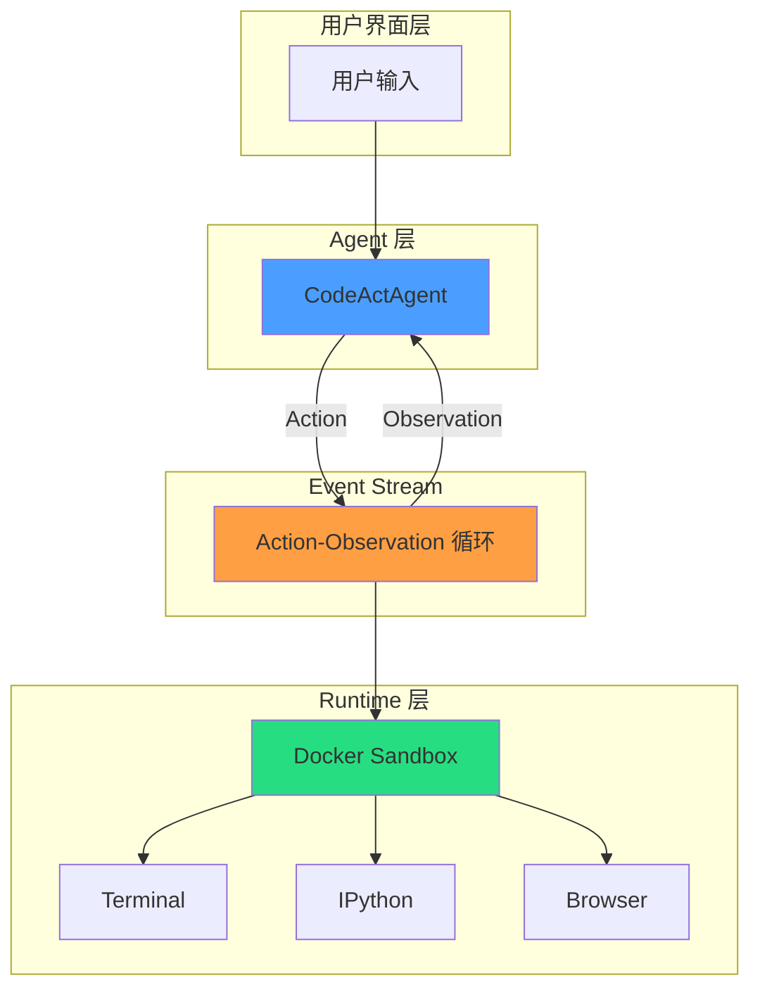
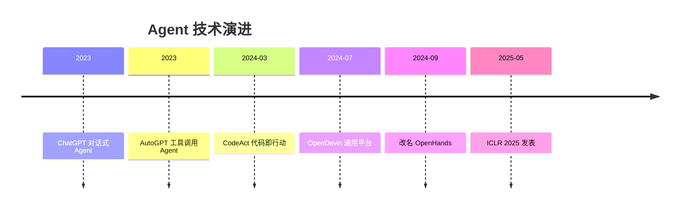
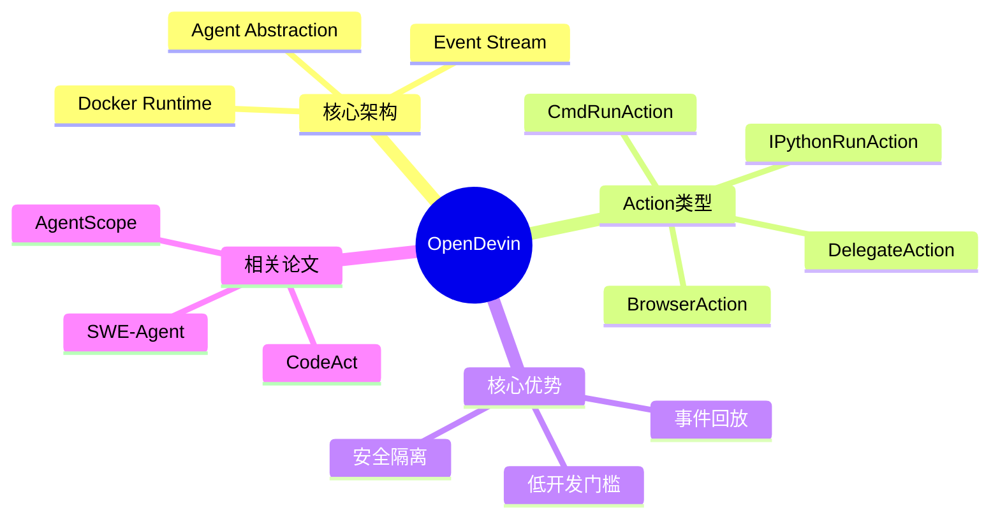

# OpenDevin - 深入阅读版本

> 📄 **原论文**: [OpenHands: An Open Platform for AI Software Developers as Generalist Agents](../pdfs/OpenDevin_2407.16741.pdf)
>
> 📓 **大白话版本**: [OpenDevin_大白话.md](./OpenDevin_大白话.md)

---

## What - 这是什么？

### 核心定义

OpenHands（原名 OpenDevin）是一个**开源、社区驱动的 AI 智能体平台**，旨在让 AI 能够像人类软件工程师一样工作——通过代码、命令行和浏览器与环境交互。

### 技术架构

```
┌─────────────────────────────────────────────────────────────┐
│                      User Interface Layer                   │
│         (CLI / Web UI / IDE Plugin / Headless)              │
└─────────────────────────┬───────────────────────────────────┘
                          │
                          ▼
┌─────────────────────────────────────────────────────────────┐
│                     Event Stream Layer                       │
│  ┌─────────────────────────────────────────────────────┐   │
│  │  Action-Observation 循环:                           │   │
│  │  [Action] → [Observation] → [Action] → ...         │   │
│  │                                                     │   │
│  │  Actions: RunCmd, RunIPython, BrowseInteractive,    │   │
│  │           Message, DelegateAgent                   │   │
│  │                                                     │   │
│  │  Observations: CmdOutput, IPythonOutput,           │   │
│  │                BrowserOutput, UserMessage          │   │
│  └─────────────────────────────────────────────────────┘   │
└─────────────────────────┬───────────────────────────────────┘
                          │
                          ▼
┌─────────────────────────────────────────────────────────────┐
│                      Agent Layer                             │
│  ┌──────────────┐  ┌──────────────┐  ┌──────────────┐     │
│  │ CodeActAgent │  │BrowsingAgent │  │ MicroAgents  │     │
│  │  (通用型)     │  │  (专家型)     │  │  (专用型)    │     │
│  └──────────────┘  └──────────────┘  └──────────────┘     │
│                                                             │
│  Agent.step(state) → Action                                 │
│  Agent.reset() → system_message                              │
└─────────────────────────┬───────────────────────────────────┘
                          │
                          ▼
┌─────────────────────────────────────────────────────────────┐
│                    Runtime Layer                             │
│  ┌─────────────────────────────────────────────────────┐   │
│  │              Docker Sandbox                           │   │
│  │  ┌─────────────┐ ┌─────────────┐ ┌─────────────┐    │   │
│  │  │  Terminal   │ │  IPython    │ │  Browser    │    │   │
│  │  │  (bash)     │ │  (Python)   │ │ (Playwright)│    │   │
│  │  └─────────────┘ └─────────────┘ └─────────────┘    │   │
│  │                                                      │   │
│  │  + AgentSkills Library (edit_file, search, etc.)    │   │
│  └─────────────────────────────────────────────────────┘   │
└─────────────────────────────────────────────────────────────┘
```

### 核心组件详解

| 组件 | 功能 | 设计理由 |
|------|------|----------|
| **Event Stream** | 时间序列化的 Action-Observation 记录 | 解耦 Agent 逻辑与执行，支持回放、中断、恢复 |
| **Agent Abstraction** | 统一的智能体接口（reset + step） | 降低开发门槛，30 行代码实现新 Agent |
| **Docker Runtime** | 隔离的代码执行环境 | 安全性：AI 代码不会破坏宿主系统 |
| **AgentSkills** | 可扩展的工具函数库 | 避免 Agent 从零学基础操作 |
| **DelegateAction** | Agent 间任务委托机制 | 专业化分工，通用 Agent + 专家 Agent 协作 |

---

## Who - 谁做的？谁在用？

### 作者团队

| 背景 | 机构 | 贡献 |
|------|------|------|
| 学术 | UIUC, CMU, Yale, UT Austin | 核心架构、评估框架 |
| 工业 | Alibaba, All Hands AI | 工程实现、社区运营 |
| 社区 | 188+ 贡献者 | Agent 实现、技能库、Bug 修复 |

### 用户群体

1. **研究者**：评估新 Agent 算法（15 个基准测试）
2. **开发者**：构建 AI 辅助工具（自动化测试、代码审查）
3. **企业**：定制专用 Agent（客服、数据分析）

### 社区影响力

- GitHub Stars: 32K+
- Contributors: 188+
- Commits: 2.1K+
- License: MIT（允许商业使用）

---

## When - 时间线

```
2024.03 ──── CodeAct 论文发布（前身概念）
    │
2024.07 ──── OpenDevin 论文发布 (arXiv:2407.16741)
    │
2024.09 ──── 改名 OpenHands（商标问题）
    │
2024.12 ──── ICLR 2025 录用
    │
2025.05 ──── ICLR 2025 正式发表
    │
Now ──────── 社区持续迭代中
```

### 技术演进脉络

| 阶段                 | 代表工作               | 核心突破               |
| ------------------ | ------------------ | ------------------ |
| 1. 对话 Agent        | ChatGPT            | 自然语言交互             |
| 2. 工具调用 Agent      | LangChain, AutoGPT | API 调用能力           |
| 3. 代码执行 Agent      | CodeAct, SWE-Agent | 代码即行动              |
| 4. **通用 Agent 平台** | **OpenHands**      | 统一架构 + 安全执行 + 开放生态 |

---

## Why - 为什么重要？

### 研究缺口分析

| 缺口类型 | 现有问题 | OpenHands 解决 |
|----------|----------|----------------|
| **功能完整性** | 各框架功能单一 | 集成代码、命令行、浏览器 |
| **安全性** | AI 代码可能破坏系统 | Docker 沙箱隔离 |
| **开放性** | 限制商业使用 | MIT 协议 |
| **评估系统性** | 缺乏统一基准 | 集成 15 个基准测试 |
| **开发门槛** | 需要深入了解框架 | 30 行代码实现 Agent |

### 核心命题验证

| 命题 | 假设 | 验证结果 |
|------|------|----------|
| P1 | 基于 PL 的动作空间 > 预定义工具调用 | ✅ 灵活执行任意任务 |
| P2 | 事件流架构能统一交互 | ✅ 支持 10+ Agent 类型 |
| P3 | Docker 沙箱提供安全环境 | ✅ 无安全事件 |
| P4 | 通用 Agent 无需任务特定提示 | ✅ SWE-Bench 26%, WebArena 15.5% |
| P5 | 开源社区驱动加速发展 | ✅ 188+ 贡献者, 32K stars |

### 学术价值

1. **首个通用 AI 软件工程师平台**：统一软件开发、网页交互、辅助任务
2. **方法论贡献**：事件流架构成为后续 Agent 系统的设计范式
3. **基准整合**：首次系统性整合 15 个跨领域基准测试

---

## How - 怎么做到的？

### 技术实现细节

#### 1. 动作空间设计

```python
# 核心动作类型
class Action:
    # 执行 bash 命令
    CmdRunAction(command: str)

    # 执行 Python 代码
    IPythonRunCellAction(code: str)

    # 浏览器交互 (BrowserGym DSL)
    BrowserInteractiveAction(browser_actions: str)

    # 委托给其他 Agent
    AgentDelegateAction(agent: str, inputs: dict)

    # 自然语言消息
    MessageAction(content: str)
```

**设计理念**：代码即行动，比预定义 API 更灵活

#### 2. 最小 Agent 实现

```python
class MyAgent(Agent):
    def reset(self):
        return SystemMessage("你是一个有用的助手...")

    def step(self, state):
        # 读取历史
        history = state.history

        # 决策
        action = self.llm.decide(history)

        return action
```

**仅需 ~30 行代码即可实现新 Agent**

#### 3. AgentSkills 工具库

| 技能 | 功能 | 使用场景 |
|------|------|----------|
| `edit_file` | 编辑文件 | 修改代码、写文档 |
| `scroll_up/down` | 滚动浏览 | 查看长文件 |
| `search_files` | 搜索代码 | 定位 bug |
| `execute_bash` | 执行命令 | 运行测试 |
| `browse_website` | 浏览网页 | 查文档、搜答案 |

#### 4. 多智能体协作

```
用户任务: "修复这个 bug 并查一下相关文档"
         │
         ▼
    ┌─────────────┐
    │ CodeActAgent│  (主 Agent)
    └──────┬──────┘
           │
    ┌──────┴──────┐
    │             │
    ▼             ▼
┌────────┐  ┌───────────┐
│ 自己修  │  │ 委托给    │
│ 代码   │  │BrowsingAgent│
└────────┘  │ 查文档     │
            └───────────┘
```

### 评估协议

| 基准测试           | 任务类型            | 评估方式    |
| -------------- | --------------- | ------- |
| SWE-Bench Lite | GitHub issue 修复 | 自动测试通过率 |
| HumanEvalFix   | 代码 bug 修复       | pass@k  |
| WebArena       | 真实网页操作          | 任务成功率   |
| GPQA           | 研究生级问答          | 准确率     |

### 性能结果

| Agent | 模型 | SWE-Bench | WebArena | GPQA |
|-------|------|-----------|----------|------|
| SWE-Agent (专用) | GPT-4 | 18.0% | - | - |
| Aider (专用) | GPT-4o | 26.3% | - | - |
| **CodeActAgent (通用)** | Claude-3.5-Sonnet | **26.0%** | **15.5%** | 52.0% |
| **CodeActAgent (通用)** | GPT-4o | 22.0% | 14.5% | **53.1%** |

**关键洞察**：通用 Agent 能与专用 Agent 抗衡！

---

## TODO - 深度思考与实践任务

### 理解检验

- [ ] **Q1**: 为什么选择"代码执行"而非"工具调用"作为主要交互方式？
  <details>
  <summary>思考提示</summary>
  考虑灵活性、可组合性、可调试性三个维度
  </details>

- [ ] **Q2**: 事件流架构与传统消息队列的区别是什么？为什么适合 Agent 系统？

- [ ] **Q3**: Docker 沙箱的优缺点是什么？有没有更好的替代方案？

### 批判性思考

- [ ] **思考 1**: 当前 26% 的 SWE-Bench 成功率是否足够实用？距离生产可用还差什么？

- [ ] **思考 2**: OpenHands 的"通用性"是否以牺牲"最优性"为代价？这是否是正确的设计权衡？

- [ ] **思考 3**: 多智能体委托机制目前是静态的，如何设计动态的任务分配？

### 实践任务

#### Level 1: 体验

- [ ] 在本地运行 OpenHands，让它帮你完成一个简单的 bug 修复
- [ ] 观察事件流中 Action 和 Observation 的交互过程

#### Level 2: 定制

- [ ] 实现一个简单的 Micro Agent（例如：专门生成单元测试的 Agent）
- [ ] 尝试让 CodeActAgent 委托任务给你的 Micro Agent

#### Level 3: 扩展

- [ ] 为 AgentSkills 添加一个新技能（例如：调用外部 API）
- [ ] 尝试在新的基准测试上评估你的 Agent

### 延伸阅读

| 关联论文 | 关系 | 阅读优先级 |
|----------|------|------------|
| CodeAct | 前身概念，定义"代码即行动"范式 | ⭐⭐⭐ |
| SWE-Agent | 专用软件工程 Agent，对比基线 | ⭐⭐ |
| BrowserGym | 浏览器交互 DSL，底层依赖 | ⭐ |
| AutoGen | 多智能体对话框架，对比架构 | ⭐⭐ |

### 开放问题（论文未解决）

1. **长程记忆**：如何让 Agent 在长任务中保持上下文？
2. **视觉能力**：当前图像理解能力有限，如何增强？
3. **成本优化**：如何降低 Token 消耗？
4. **错误恢复**：Agent 犯错后如何自动纠正？

---

## 关键概念索引

| 概念 | 定义 | 重要性 |
|------|------|--------|
| Event Stream | 时序化的 Action-Observation 记录 | ⭐⭐⭐ 核心架构 |
| Docker Sandbox | 隔离的代码执行环境 | ⭐⭐⭐ 安全基础 |
| AgentSkills | 可扩展的工具函数库 | ⭐⭐ 效率提升 |
| DelegateAction | Agent 间任务委托 | ⭐⭐ 协作机制 |
| CodeAct | 代码即行动范式 | ⭐⭐⭐ 设计理念 |

---

## 笔记元数据

| 属性 | 值 |
|------|-----|
| 阅读日期 | 2026-03-28 |
| 阅读时长 | 约 2 小时 |
| 理解程度 | ████████░░ 80% |
| 实践程度 | ███░░░░░░░ 30% |
| 下一步 | 本地运行 OpenHands，完成 Level 1 任务 |

---

## 可视化

### 核心流程图 (Mermaid)



### 技术演进时间线



### 概念关系图



> 🎨 **Canvas 思维导图**: [OpenDevin.canvas](./OpenDevin.canvas) - 可视化论文结构